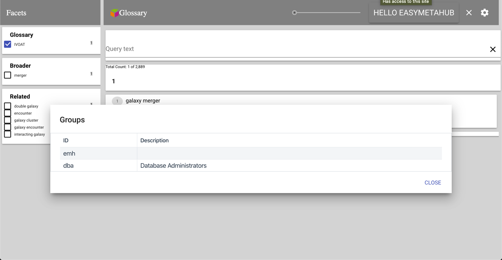
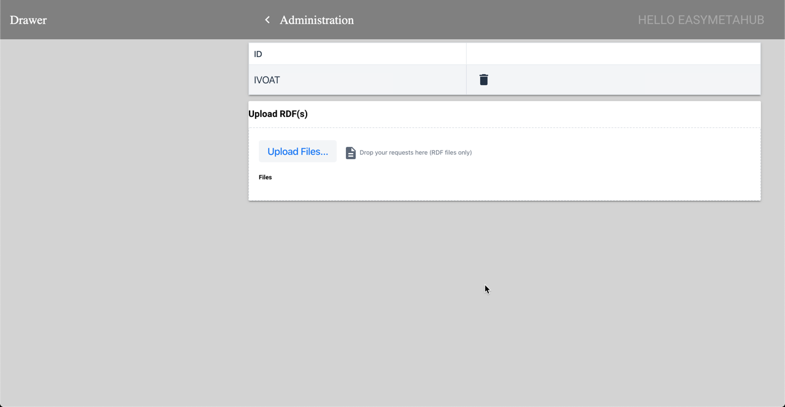

# EasyMetaHub Glossary for an eXist-db project

There a many projects out there that do not require the power of MarkLogic and the licensing fees for it as well.  
[http://history.state.gov](http://history.state.gov) is one such project.  It has been using eXist-db as its hosting platform.

This is a starting point for most search programs.  It is a general purpose viewer for SKOS taxonomies.

Download version 5 of eXist-db from here: 
[http://exist-db.org/exist/apps/homepage/index.html](http://exist-db.org/exist/apps/homepage/index.html)

## Development

### Requirements

* Gradle 
[https://gradle.org/install/](https://gradle.org/install/)
* npm 
[https://www.npmjs.com/get-npm](https://www.npmjs.com/get-npm)
* Polymer-cli 
[https://polymer-library.polymer-project.org/3.0/docs/tools/polymer-cli#install](https://polymer-library.polymer-project.org/3.0/docs/tools/polymer-cli#install)

### Building

In the root directory of the application run:

```gradle buildXAR```

The build is in the ```build``` directory.

### Customization

The customizations for this project template are in:

- src/main/xquery/modules/custom/custom.xqm
- src/main/resources/collection.xconf
- src/main/polymer/src/emh-accelerator-app/result-item.js

## Basic installation and getting started is here:

[http://exist-db.org/exist/apps/doc/basic-installation](http://exist-db.org/exist/apps/doc/basic-installation)

The initial view when you open your browser to 
[http://localhost:8080](http://localhost:8080) is:


Click login and usee the username admin with no password.


You will then see the page 


Select the 'Package Manager'


Click on 'Upload' and select emh-glossary-0.8.0.xar


The EMH Glossary shows up in the installed list.


Close the dialog and you will get this:


Type *Galaxy* in the search bar.


You can then select a facet to narrow the search results.  You can also expand a result item by selecting *Show Details*


If you select one of the buttons for *Related*, *Broader*, or *Narrower*, then you will be hyperlinked to that *Concept*


## Authentication and Authorization

This glossary manager in searchable as a *guest*.  In order to manage the glossaries, then you need to go the the *Administration* screen.  Click on *HELLO GUEST*.


This page shown the user as logged in.


Click on the username to get details of the user.


The details about the user show up in a dialog, including the groups that the user is part of.



## Administration

In order to go to the administration screen, you need to be logged in as part of the *emh* group and click on the *gear* icon.


This page shows the list of glossaries that are loaded and the ability to load more glossaries.



You can delete a glossary by clicking on the trash can by the name.  You can add glossaries by uploading RDF files containing either SKOS or SKOS-XL.

Sample glossaries can be found here: 
[https://github.com/easymetahub/emh-exist-glossary/tree/master/samples](https://github.com/easymetahub/emh-exist-glossary/tree/master/samples)

Click on the chevron next tothe Administration header to return the the search page.


## Donation

If you find this template application useful, then I would appreciate a contribution to the development through PayPal to loren.cahlander@easymetahub.com


