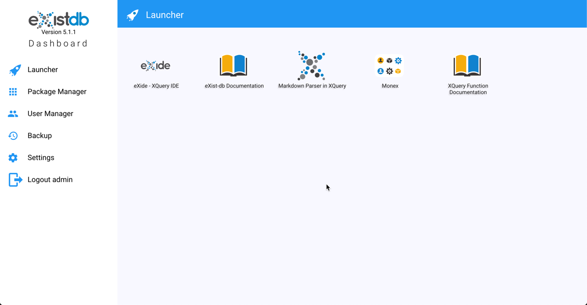
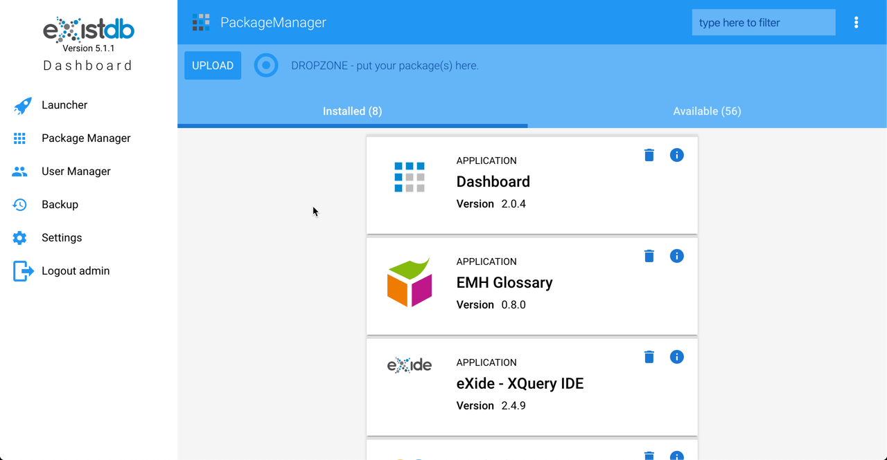

# EasyMetaHub Accelerator for an eXist-db project

There a many projects out there that do not require the power of MarkLogic and the licensing fees for it as well.  
[http://history.state.gov](http://history.state.gov) is one such project.  It has been using eXist-db as its hosting platform.

This is a starting point for most search programs.  It is a general purpose viewer for SKOS taxonomies.

Download a release candidate for version 5 of eXist-db from here: 
[https://bintray.com/existdb/releases/exist/5.0.0-RC7/view](https://bintray.com/existdb/releases/exist/5.0.0-RC7/view)

The basic installation and getting started is here:

[http://exist-db.org/exist/apps/doc/basic-installation](http://exist-db.org/exist/apps/doc/basic-installation)

The initial view when you open your browser to 
[http://localhost:8080](http://localhost:8080) is:

Click login and usee the username admin with no password.

You will then see the page 

Select the 'Package Manager'

Click on 'Upload' and select emh-accelerator-1.0.0.xar

The EMH Accelerator shows up in the installed list.

Select 'Launcher' and the EMH Accelerator shows up in the list of applications.

Click on the accelerator:

Click on the upload button

Click on 'upload files' and select IVOAT.rdf or drag the file onto the upload dialog.

Close the dialog and you will get this:

Type *Galaxy* in the search bar.

You can then select a facet to narrow the search results.  You can also expand a result item by selecting *Show Details*

If you select one of the buttons for *Related*, *Broader*, or *Narrower*, then you will be hyperlinked to that *Concept*

The customizations for this project template are in:

- src/main/xquery/modules/custom/custom.xqm
- src/main/resources/collection.xconf
- src/main/polymer/src/emh-accelerator-app/result-item.js
